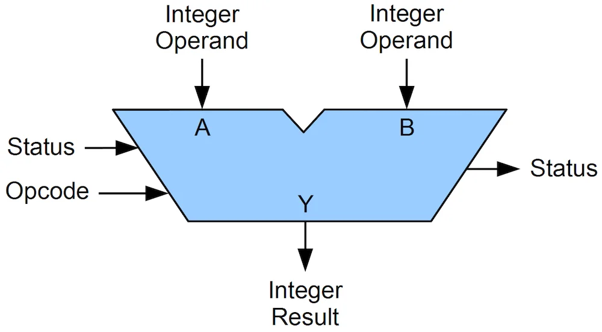
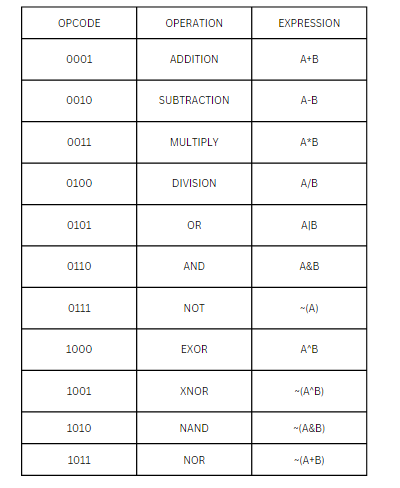

# 8-bit-ALU-in-Verilog

## Introduction
This repository features a fully implemented 4-bit Arithmetic Logic Unit (ALU) capable of performing a wide range of arithmetic and logical operations. The ALU is a critical component in digital systems, including CPUs and GPUs, designed to handle both computational and logical tasks.

Key Features:
### Arithmetic Operations:

`Addition
`Subtraction
`Multiplication
`Division

### Logical Operations:

> | AND  |
> OR   |
> NOT  |
> XOR  | 
> XNOR |
> NAND |
> NOR  |

Each operation is triggered by a unique opcode, ensuring accurate execution. This design makes the ALU flexible and efficient for diverse tasks.

    

An ALU takes **operands** as input data and **opcodes** to specify the operation to be performed. These inputs enable the ALU to execute arithmetic and logical operations effectively.

## Opcodes  

    

